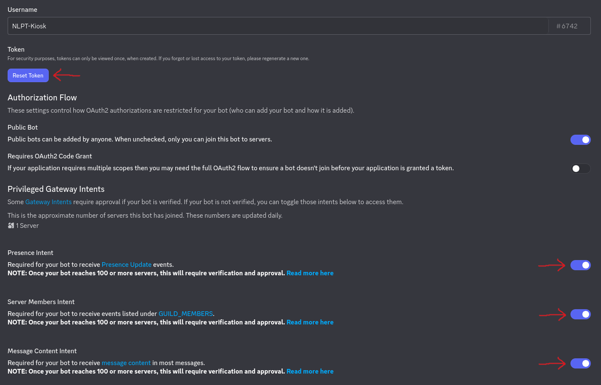
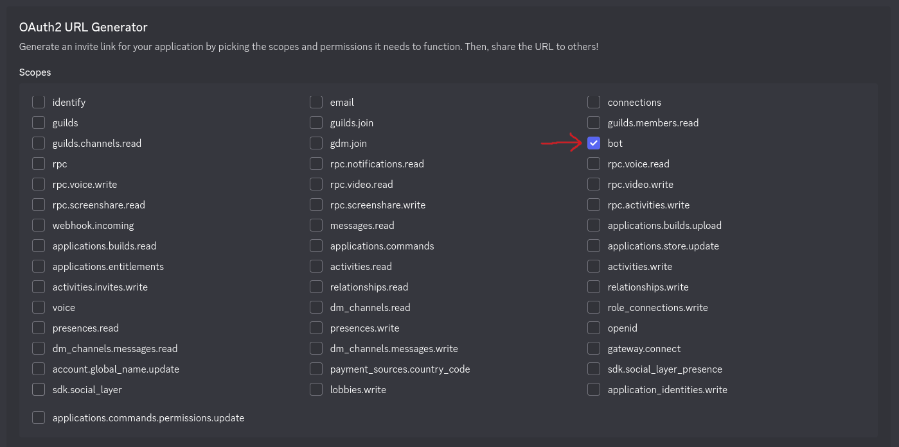
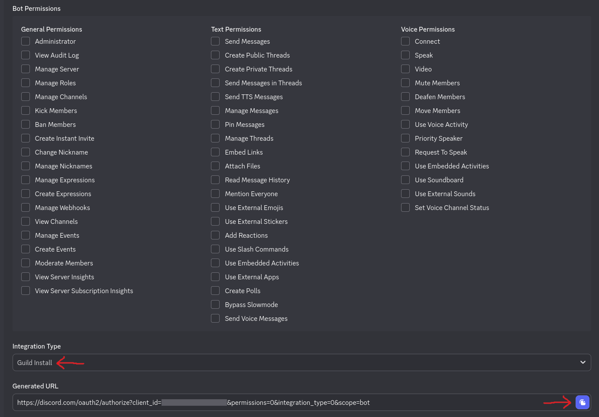

# Setup PlayerCount Fetching from Discord

This guide covers creating a Discord Bot to enable the **Player Counts - Discord** ScreenTemplate (and the Discord source in **Player Counts - Multi**) to count members playing games within your Discord guild.

## Create a Discord Bot

If not already done, create a Discord Bot. This bot will live on your Discord server and track player activities to be read by NLPT-Kiosk.

First open the Discord Developer Portal: [https://discord.com/developers/applications](https://discord.com/developers/applications)

Create a "New Application" and give it a name. Configure it as follows:

### Settings → Bot

- Click **Reset Token** and securely save it away (you need it later in the NLPT-Kiosk Admin Interface)
- Enable **Presence Intent**
- Enable **Server Members Intent**
- Enable **Message Content Intent**
- Click **Save**

### Settings → OAuth2

- In the **OAuth2 URL Generator** section, enable **bot**
- In **Bot Permissions**, enable **nothing**
- Set **Integration Type** to **Guild Install**
- Copy the **Generated URL**
- Paste the copied URL in a new browser tab or window and follow the steps — ensure you select the guild (server) you want to get player counts from

## Setup within Admin Interface

1. Open the Admin Interface at `http://<server_addr>/admin`
2. Login as an admin user
3. Navigate to **User → Settings**
4. Find `discord_bot_token` and enter the saved token from above
5. Hit **Save**

After this setup, the system is connected to Discord and is already fetching player data from your server (guild). To show those counts, create a new Screen:

1. Navigate to Manage **Screens → New**
2. Select `Player Counts - Discord` or `Player Counts - Multi` as template
3. If you like to apply player filters for this Screen, configure them with `guild` and `role`
4. The rest of the configuration is as usual
5. Add this Screen to a Timeline as you would with any other Screen

> [!NOTE]  
> If you like to use player filters, select a guild first — depending on the selected guild, the frontend requests the available roles from the backend.

> [!IMPORTANT]  
> With the `prometheus-endpoint` (can be enabled in **User → Settings**) only the content used by Screens is exported. This means: all guild- and role-filter combinations that are used on Screens are reflected in the exported data. Therefore a game can have multiple entries (with different counts) if it is covered by multiple filters.
