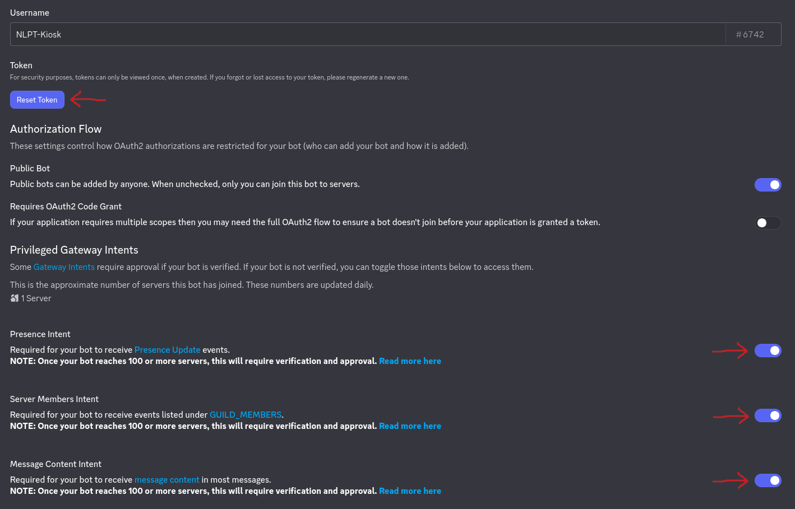
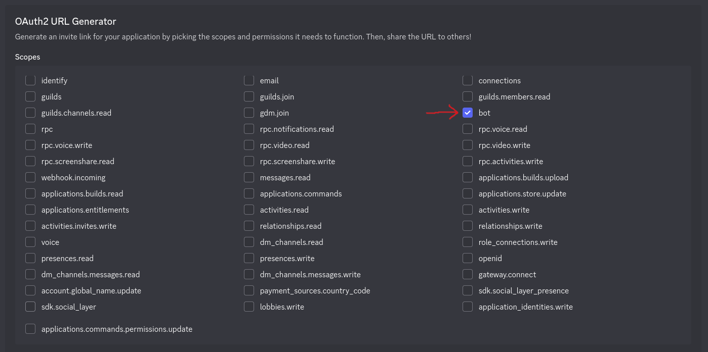
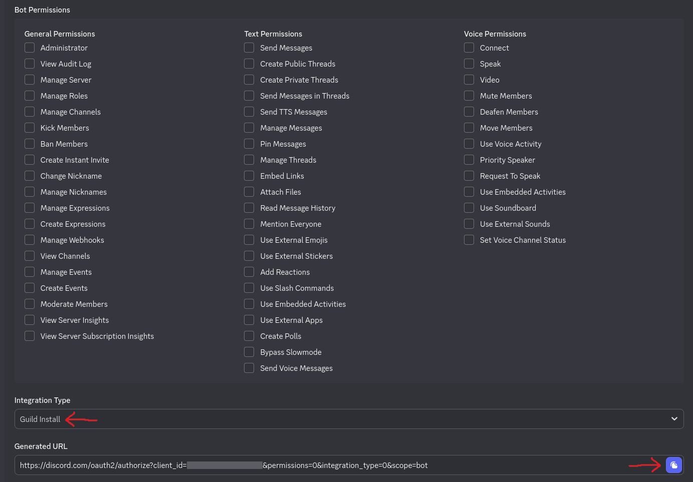

# Setup Discord Bot Integration

This guide covers creating a Discord Bot to enable **Player Counts** screens and the **Announcements** screen's Discord Polls feature. The bot captures guild data (members, roles, channels), player activities, and polls from your Discord server for display on kiosks.

## What the Bot Captures

| Element | Description |
|---------|-------------|
| `DiscordGuild` | Guild/server names |
| `DiscordRole` | Role names per guild |
| `DiscordMember` | Member names, current game (from presence), role IDs — updated on every presence change |
| `DiscordChannel` | Text channel names per guild — created/deleted events tracked |
| `DiscordPoll` | Poll questions, options, active status, expiry timestamps — captured on creation and result finalization |

## Create a Discord Bot

If not already done, create a Discord Bot. This bot will live on your Discord server and track player activities and polls to be read by NLPT-Kiosk.

First open the Discord Developer Portal: [https://discord.com/developers/applications](https://discord.com/developers/applications)

Create a "New Application" and give it a name. Configure it as follows:

### Settings → Bot

- Click **Reset Token** and securely save it away (you need it later in the NLPT-Kiosk Admin Interface)
- Enable **Presence Intent** — required to detect what games members are playing
- Enable **Server Members Intent** — required to read member roles
- Enable **Message Content Intent** — required to capture poll data from messages
- Click **Save**

### Settings → OAuth2

- In the **OAuth2 URL Generator** section, enable **bot**
- In **Bot Permissions**, enable **nothing** (the bot does not need explicit permissions for reading presence, members, or messages)
- Set **Integration Type** to **Guild Install**
- Copy the **Generated URL**
- Paste the copied URL in a new browser tab or window and follow the steps — ensure you select the guild (server) you want to capture data from

## Setup within Admin Interface

1. Open the Admin Interface at `http://<server_addr>/admin`
2. Login as an admin user
3. Navigate to **User → Settings**
4. Find `discord_bot_token` and enter the saved token from above
5. Hit **Save**

After this setup, the system is connected to Discord and begins capturing data from your server (guild). The bot runs as a background daemon process that:

- On startup: clears and re-indexes all cached guilds, roles, members, channels, and polls
- Continuously: captures presence updates (member games/roles), new polls on messages, poll result finalizations, channel creation/deletion events
- In DMs: responds to the `debug` command with a list of all captured members and their current games

## Using Captured Data

### Player Counts Screens

To show player counts from Discord, create a new Screen:

1. Navigate to Manage **Screens → New**
2. Select `Player Counts - Discord`, `Player Counts - Prometheus`, or `Player Counts - Multi` as template
3. If you want to filter by guild/role, configure those filters — select a guild first so the frontend can request available roles from the backend

> [!NOTE]  
> With the `prometheus-endpoint` (can be enabled in **User → Settings**) only the content used by Screens is exported. This means: all guild- and role-filter combinations that are used on Screens are reflected in the exported data. Therefore a game can have multiple entries (with different counts) if it is covered by multiple filters.

### Discord Polls in Announcements Screen

To display live polls from Discord channels:

1. Navigate to Manage **Screens → New**
2. Select the **Announcements** template
3. Configure these variables:
   - `src_discordpolls`: set to `true`
   - `discord_guild`: enter the guild ID (optional, filters polls to a specific guild)
   - `discord_channels`: enter an array of channel IDs to poll for active polls (e.g., `["1234567890", "0987654321"]`)

Polls are displayed with their question, options (in a flex row), and a countdown timer showing how much time remains. Expired polls are automatically hidden.
