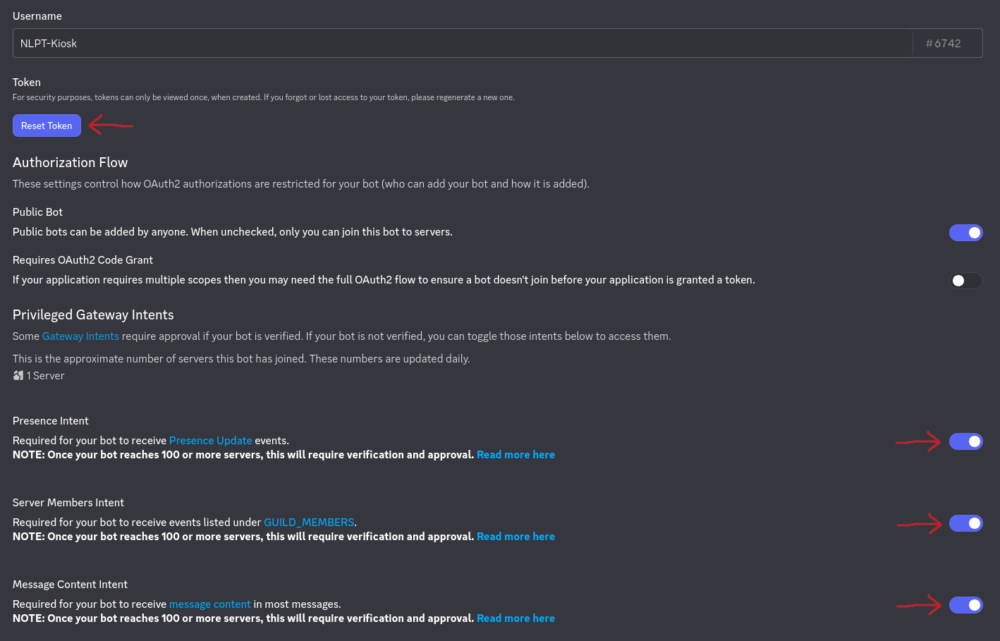
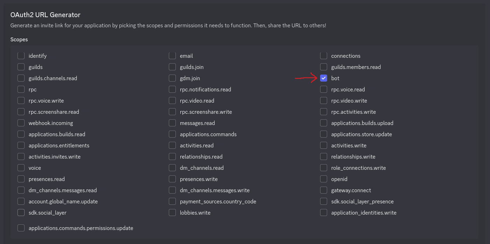
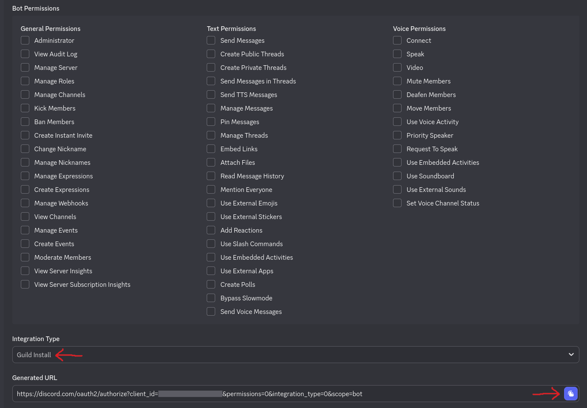

# Setup PlayerCount fetching from Discord

## Create a Discord Bot

If not already done... Create a Discord-Bot. This Bot is going to life on your Discord-Server and tracks player activities to be read by NLPT-Kiosk.

First open the Discord-Developer-Portal: [https://discord.com/developers/applications](https://discord.com/developers/applications)

Create a "New Application" and give it a name. Configure it as follows:

### Settings->Bot

  * Click `Reset Token` and securely save it away (we need it later on in NLPT-Kiosk Admin-Interface)
  * Enable `Presence Intent`
  * Enable `Server Members Intent`
  * Enable `Message Content Intent`
  * `Save`

### Settings->OAuth2

  * in `OAuth2 URL Generator` section enable `bot`
  * in `Bot Permissions` section enable **nothing**
  * set `Integration Type` to `Guild Install`
  * copy the `Generated URL`
  * paste the copied URL in a new Tab or Window and follow the steps, ensure to select the server (guild) you like to get PlayerCounts from

## Setup within Admin-Interface

TBD
