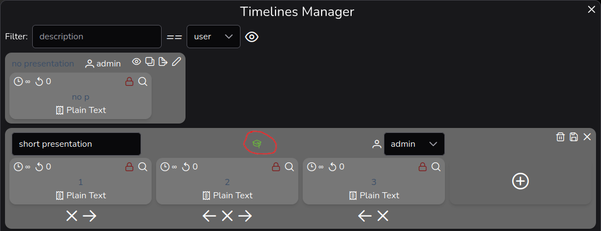
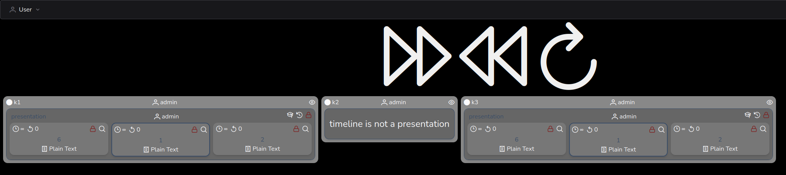

# Presenter Interface

Compared to the Admin-Interface it is a read-only interface focused on managing live presentations across Kiosks during events. It provides global presentation controls and a simplified kiosk overview without edit capabilities.

This interface is available for Users with the **Presenter** role. It can be reached by the menu *User->Presenter Interface*

  * Go to *User->Manage Users* and tick the checkbox **Presenter** for a particular User

Check out *Tools->Presentation Wizard* in the Admin-Interface to import PDFs as presentation TimelineTemplates in one go.

> [!NOTE]
> Timelines must be configured as presentation to be controled by *Presenter Interface*. To do so go to *Timelines Manager* (in *Admin Interface*) edit a Timeline and toggle the *graduation-cap*
> 

## Overview

The interface is divided into three main areas:

  * **Top menu bar**: Navigation and user settings (same as Admin-Interface but with Presenter-specific options)
  * **Global presentation controls**: Three large buttons for controlling the current presentation across all kiosks
  * **Kiosk overview**: Cards showing each kiosk's currently displayed timeline

### Global Presentation Controls

Three prominent icons provide control over live presentations:

  * **Forward** (double-right-arrow): Skip to the next Screen in all active presentation Timelines
  * **Backward** (double-left-arrow): Go back to the previous Screen in all active presentation Timelines
  * **Restart** (refresh icon): Reset all active presentation Timelines to their first Screen

The buttons can be toggled between large and small sizes via the User menu (*Show big Buttons* / *Show small Buttons*).

### Kiosk Cards

Each kiosk card shows:

  * In the upper left corner, a (filled) circle indicating if this is a common or private kiosk
    * besides this the description (or name) of the kiosk
  * The User owning this kiosk
  * The timeline currently displayed on the kiosk (in compact, read-only mode)

### Kiosk Actions in Presenter Mode

In presenter mode, most editing capabilities are disabled. Available actions:

  * **Eye / Eye-slash**: Hide or unhide a kiosk from view (for users who have hidden it before)

The following actions are **hidden** in presenter mode:
  * Edit (pencil icon)
  * Apply next Timeline (save icon)
  * Create new Timeline (plus-circle icon)
  * Select timelines as next or default

### Non-Presentation Timelines

If a kiosk has an active timeline that is not marked as a presentation, the card displays:

> **timeline is not a presentation**

This helps presenters quickly identify which kiosks are in presentation mode and which are not.

## Menu Options

The User menu provides the following options:

  * **Change Password**: Open password change dialog
  * **Profile**: Open profile settings panel
  * **Show/Suppress hidden Kiosks**: Toggle visibility of previously hidden kiosks
  * **Show big Buttons / Show small Buttons**: Toggle presentation control button size
  * **Admin Interface**: Navigate to the full Admin-Interface (if user has admin privileges)
  * **Logout**: Log out of the system

## Real-Time Updates

The interface uses WebSocket connections to receive real-time updates when:

  * A kiosk's active timeline changes
  * A new timeline is created or deleted
  * Screens, screen templates, timelines, or media are modified
  * User profiles are updated

This ensures the presenter always sees the current state of all kiosks without manual refresh.

## Technical Perspective

Just for curiosity here is what happens on presentation controls.

### Forward / Backward / Restart buttons

  * The respective function (*execForward*, *execBackward*, *execRestart*) in the Presentation-Service is called
  * A `PUT` request is sent to the `/presentation/forward/`, `/presentation/backward/`, or `/presentation/restart/` endpoint
  * The backend validates that the user is authorized (logged-in session) and has either **admin** or **presenter** role
  * If authorized, a WebSocket message is broadcast via `transmit_presentation_update()` to notify all connected clients of the presentation change

## Requirements for Presenter Role

To access this interface, a user must have either:

  * **Admin** role: Full access to all interfaces and features
  * **Presenter** role: Access to the presenter interface and presentation

The backend enforces these permissions on the presentation endpoints (`/presentation/*`), returning HTTP `403 Forbidden` for users without the required role.
