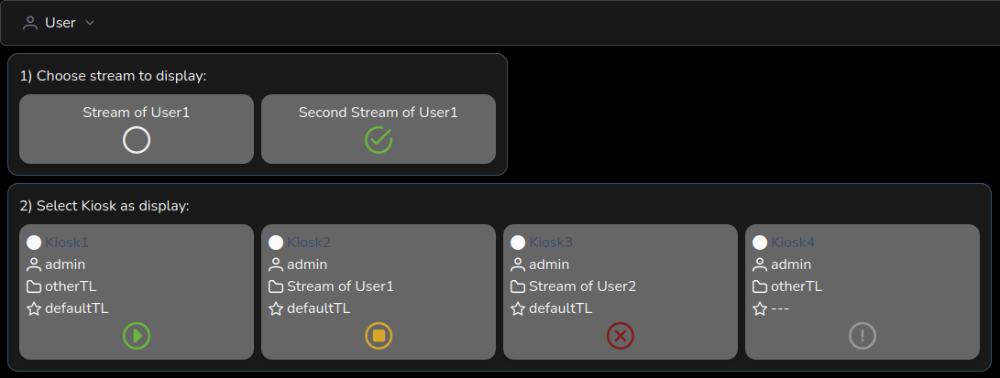

# Streamer Interface

Compared to the Admin-Interface it is an simplified interface that focuses on starting and stopping the presentation of Streams on Kiosks.

This interface is available for all logged in Users. It can be reached by the menu *User->Streamer Interface*  
But it can also be configured to be the default interface for a User after login.

  * Go to *User->Manage Users* and tick the checkbox **Streamer** for a particular User
  * Or the User it-self can set this preference in *User->Profile*

## Overview

In essence only two clicks are required to display a Stream on a Kiosk

  * First select the TimelineTemplate with the Stream you like to present (the green hook indicates it is selected)
  * Second click on the green play-button for a Kiosk to apply the TimelineTemplate

If there is only one TimelineTemplate available for a User, containing a Stream, this is already preselected.

### Kiosk buttons

On a Kiosk there is not necessarily a green play-button, following options are possible:

  * greyed-out play-button: Select a TimelineTemplate first
  * green play-button: Start displaying a TimelineTemplate
  * orange stop-button: Stop displaying a Stream (and revert back to the default Timeline for this Kiosk)
  * red times-button: Another User is already displaying a Stream on this Kiosk (which you can't override)
  * greyed-out exclamation-mark: This Kiosk does not have a default Timeline defined, and can't be used by this interface

### Requirements for Timeline(Templates) to be shown

As this interface is intended to display Streams the pickable TimelineTemplates need to obey to the following requirements, to be selectable:

  * the TimelineTemplate must be owned by the logged in User (or the current User must be an admin)
  * the TimelineTemplate must exactly contain one Screen
  * this Screen must have a key of *stream-player*
  * the Screen must be owned by the loggeg in User (or the current User must be an admin)

To have it easier to fullfill these requirements, there is the *Stream Wizard* on the Admin-Interface. It creates the required Media, Screen and TimelineTemplate, for a User, in one go. Check it out if haven't already ;)

### Information shown on Kiosk card

Besides the prior mentioned buttons there are some more information shown on the Kiosk cards, which can be useful.  
From top to bottom these are:

  * in the upper left corner, a (filled) circle indicating it this is a common or private Kiosk
    * besides this the description (or name) of the Kiosk
  * the User owning this Kiosk
  * the description of the currently displayed Timeline
  * the description of the default Timeline for this Kiosk

## Technical perspective

Just for curiosity here is what happens on the Kios button clicks.

### play-button

  * the *apply_timelinetemplate* function on the Kiosk-endpoint is called
  * first some validation is executed (User permission, preconditions, ...)
  * a Timeline is created according to the selected TimelineTemplate
  * the *single_shot* flag is set for the Timeline (this automatically deletes the Timeline after it's not displayed anymore)
  * the newly created Timeline is set as the active Timeline of the Kiosk

### stop-button

  * the *apply_default* function on the Kiosk-endpoint is called
  * first some validation is executed (User permission, preconditions, ...)
  * the active Timeline of the Kiosk is set to None
  * immediate after this the active Timeline is set to the default Timeline of the Kiosk
